# 🛒 Olio Backend

Olio is a full-featured eCommerce backend application built with **Spring Boot**, designed to support a robust online shopping experience. It handles core functionalities such as user authentication, product management, cart operations, and order processing via a RESTful API.

---

### 🚀 Live Demo

👉 [View Live](https://olio-frontend-nlhh.vercel.app/)
<!-- 🔐 Admin login enabled (read-only view for public users) -->

---

### 🖼️ Screenshots

#### Login Page

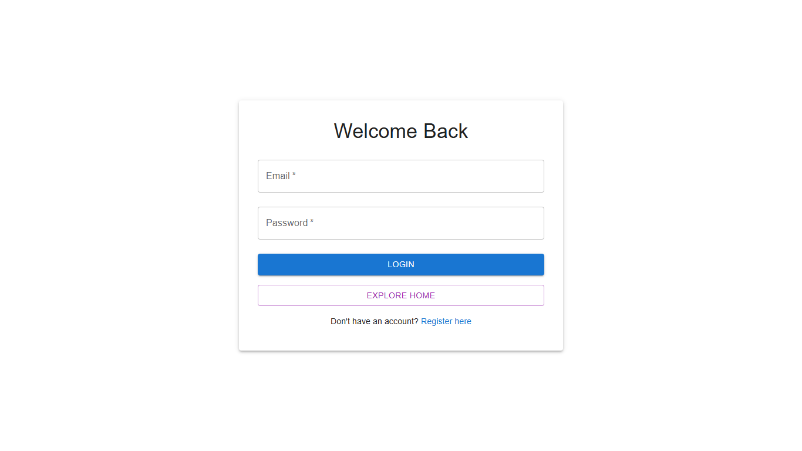
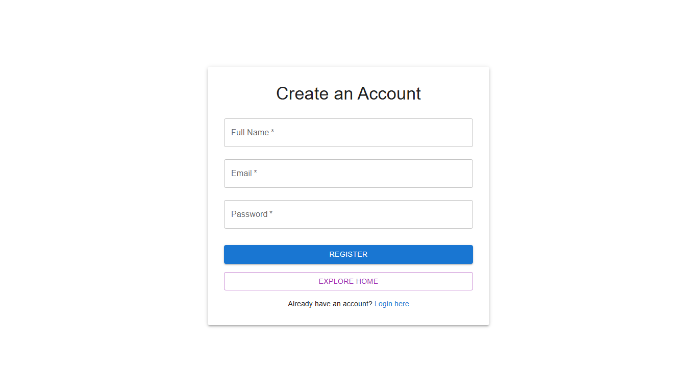

#### Home View

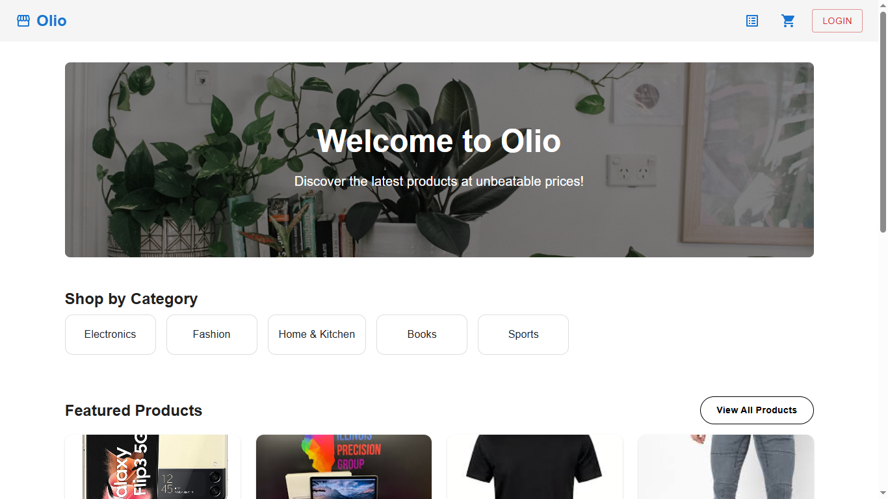

#### All Product View

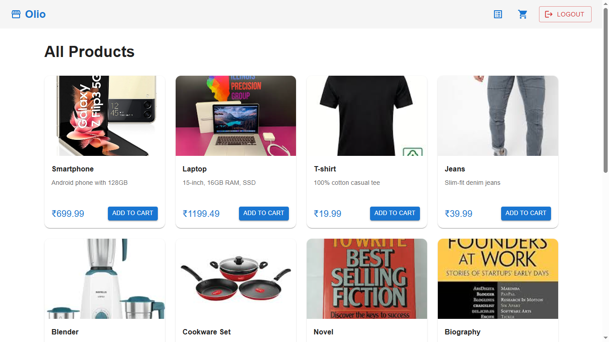

#### Product Category View

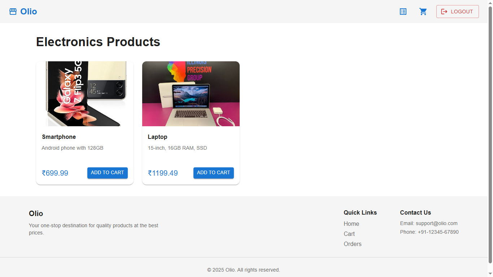
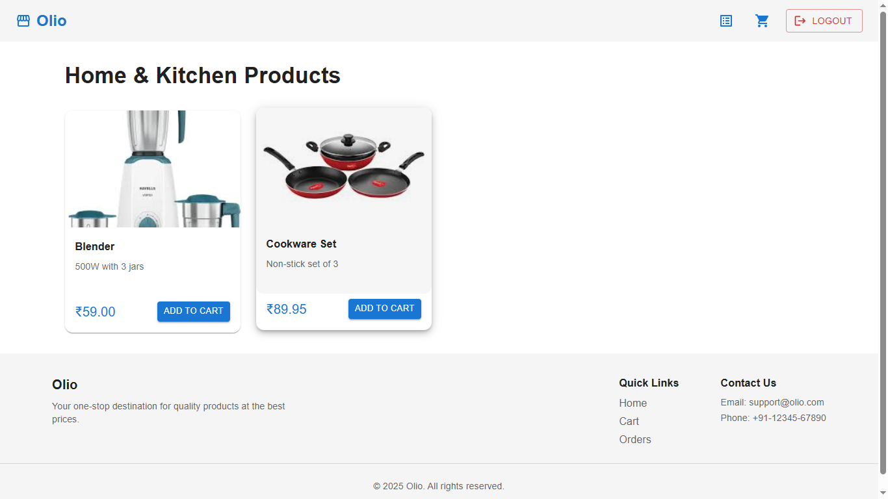

#### Cart View

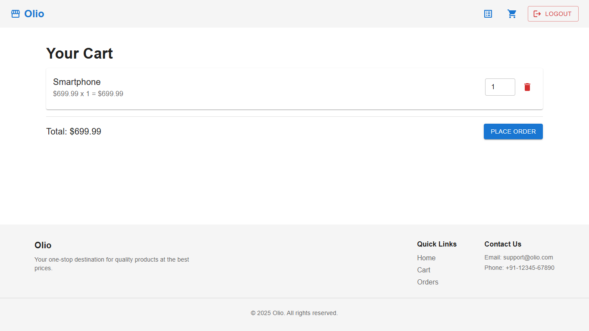

#### Orders View

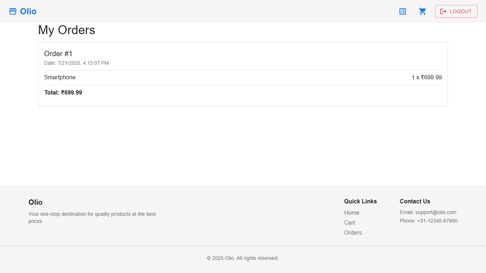

### Admin Screens

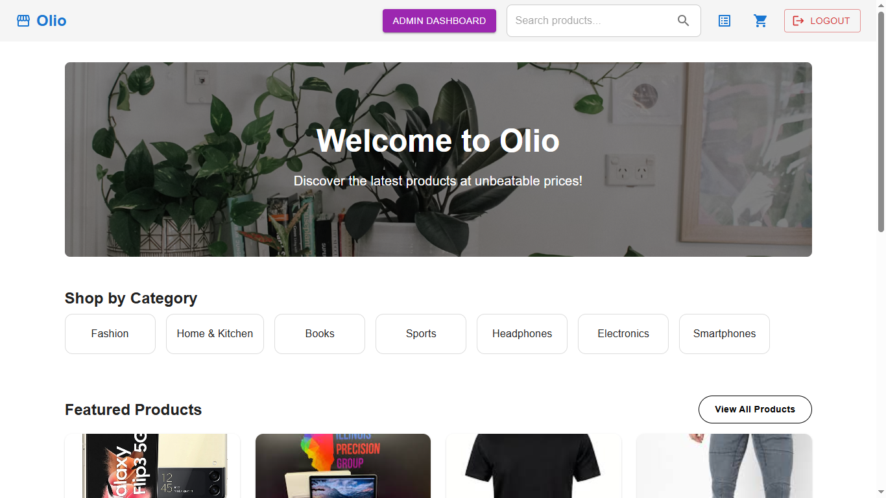
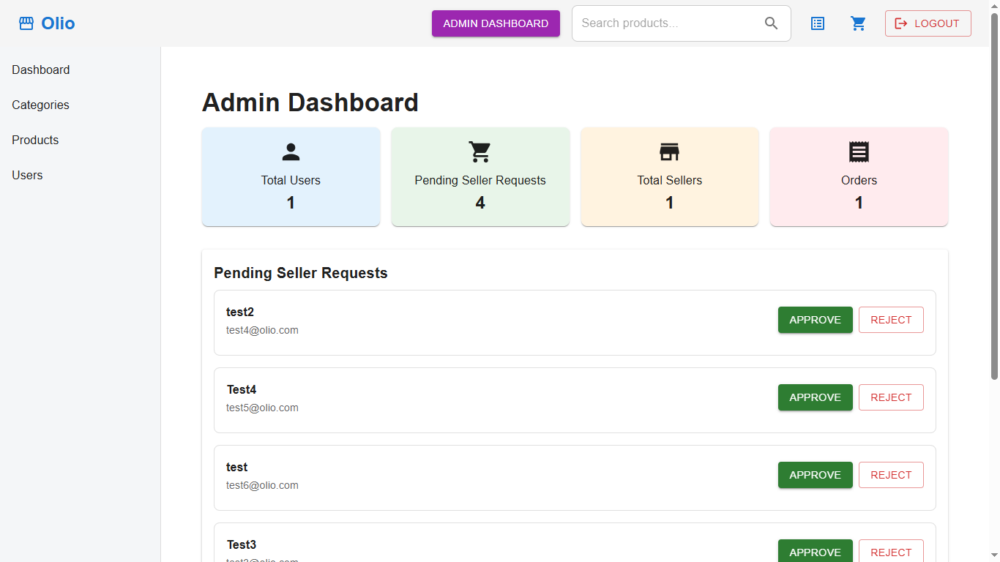
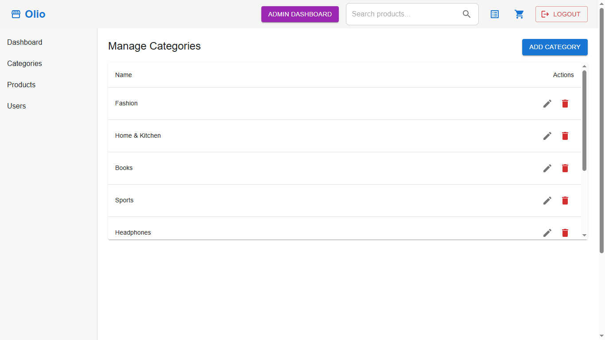
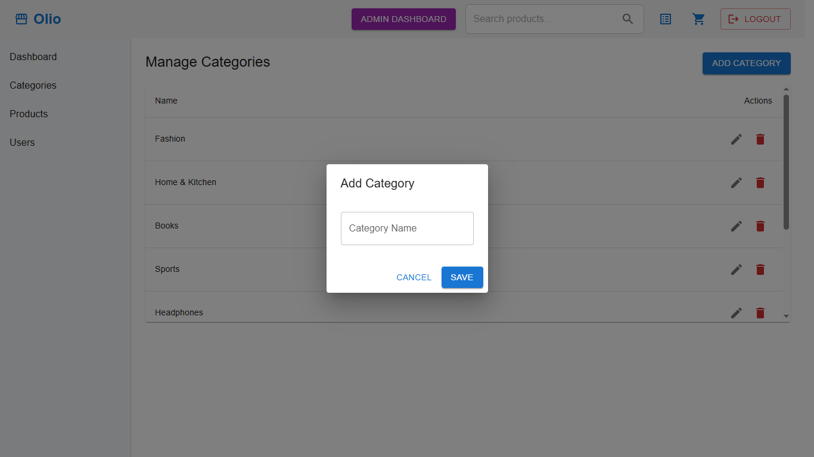
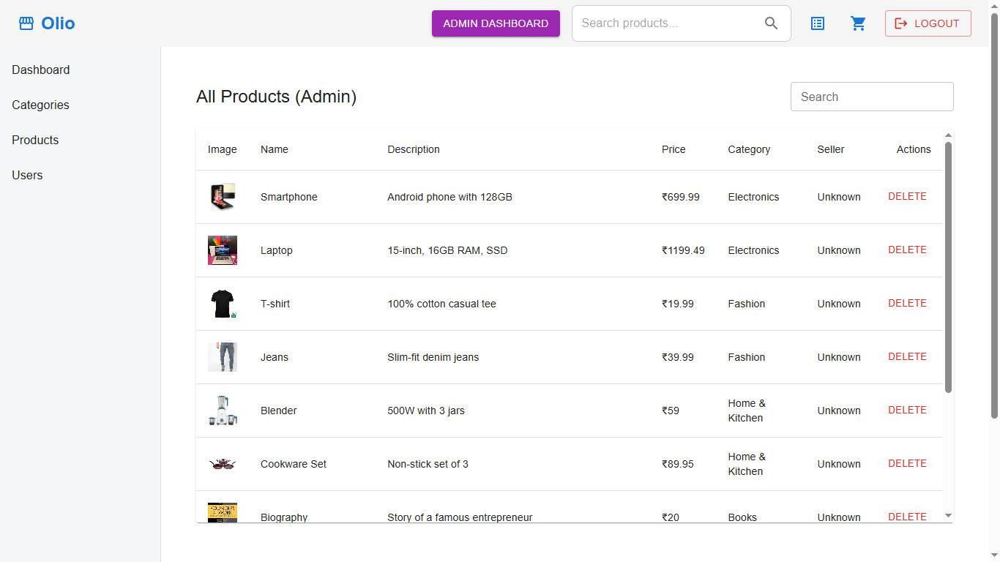
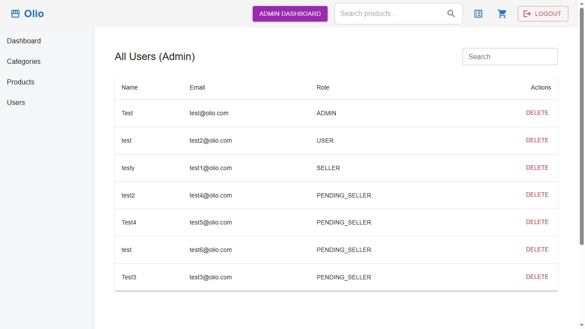

### Seller Screens

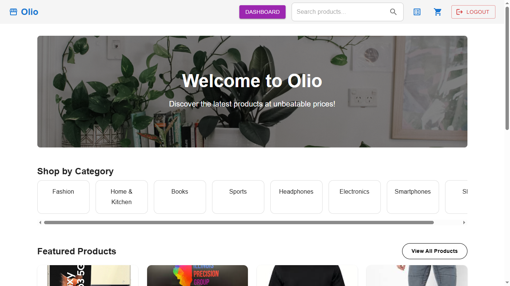
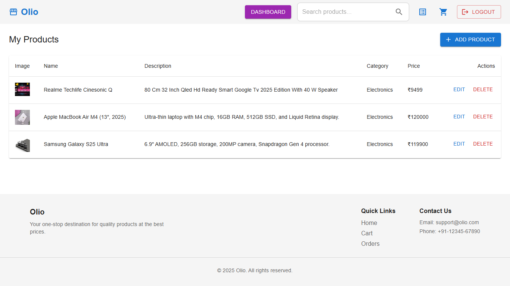
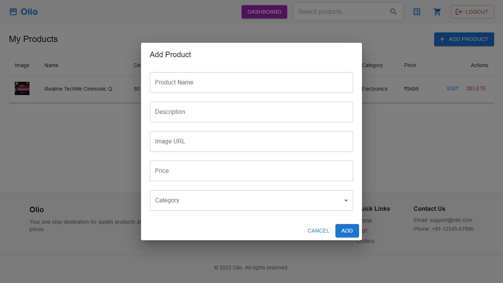

### User Screens

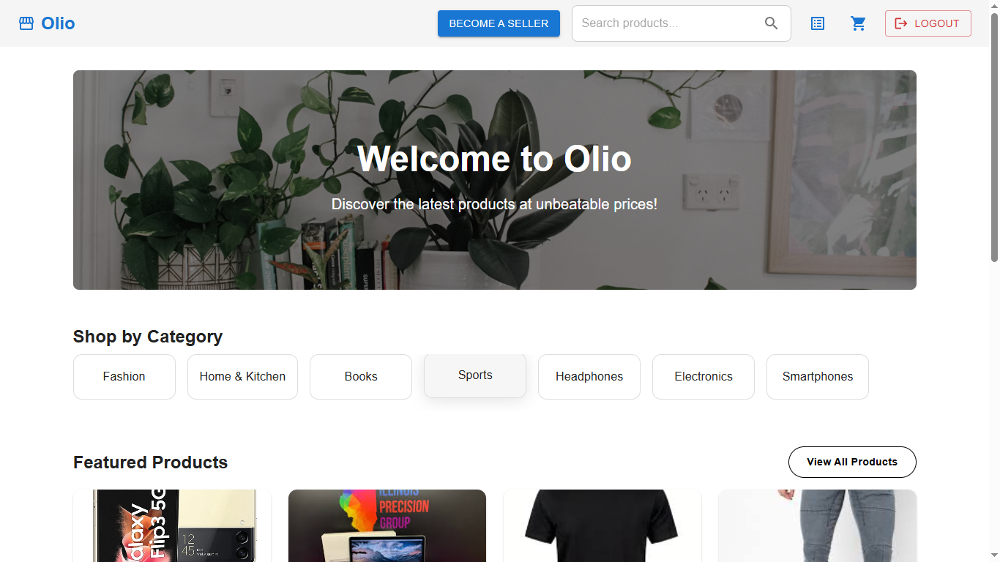
---

## 🚀 Features

- **JWT Authentication** (Login / Register)
- **Role-Based Authorization**
- **Product Management** (Add, update, delete, view)
- **Category Management**
- **Cart Functionality** (Add, update, remove items)
- **Order Placement**
- **User-Specific Operations**
- **Global Exception Handling**
- **CORS Configuration** for frontend integration

## 🧰 Tech Stack

- **Spring Boot**
- **Spring Security + JWT**
- **Hibernate / JPA**
- **MySQL**
- **Lombok**
- **Maven**

## 📁 Folder Structure

src/  
├── config/   
├── controller/  
├── dto/  
├── exception/  
├── model/  
├── repository/  
├── security/  
├── service/  
└── OlioApplication.java


## 🛠️ Setup & Run

### Prerequisites

- Java 17+
- Maven
- MySQL

### Environment Configuration

Create an `.env` file or configure the following in `application.properties`:

```properties
spring.datasource.url=jdbc:mysql://localhost:3306/olio
spring.datasource.username=your_mysql_username
spring.datasource.password=your_mysql_password

jwt.secret=your_secret_key
jwt.expiration=3600000
```

# Build & run
mvn clean install  
mvn spring-boot:run

App will start on: http://localhost:8080

---

### 🌍 Deployment

Frontend: https://olio-frontend-nlhh.vercel.app

Backend: https://olio-backend-x2hq.onrender.com

### 📦 Backend Repository

👉 [Olio Backend](https://github.com/evoAB/olio-backend)